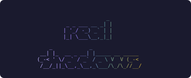
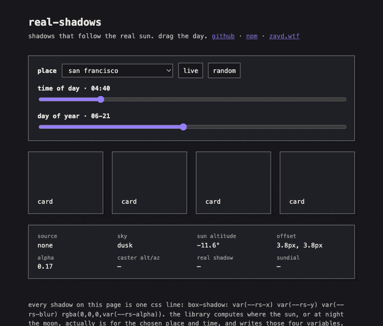
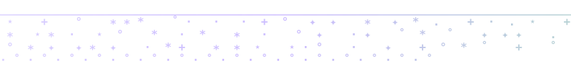
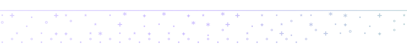
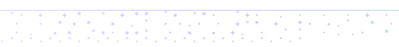
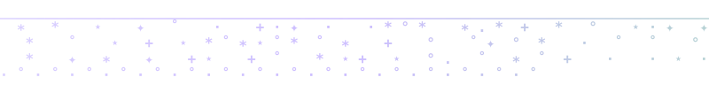
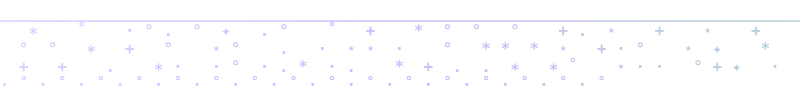
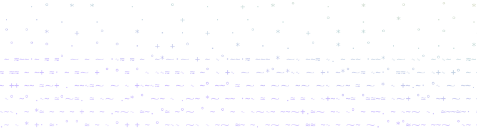

<p align="center">
  
</p>

<h1 align="center">real-shadows</h1>

<p align="center">shadows that follow the real sun. and at night, the real moon.</p>

<p align="center">
  
  
  
  
</p>

<p align="center">
  <a href="#what-it-does">what it does</a> · <a href="#install">install</a> · <a href="#quickstart">quickstart</a> · <a href="#api">api</a> · <a href="#accuracy">accuracy</a> · <a href="#the-sundial">the sundial</a> · <a href="#how-the-math-works">how the math works</a>
</p>

<br>

<p align="center">
  <a href="https://zaydiscold.github.io/real-shadows/">
    
  </a>
</p>

<p align="center"><sub>one day over san francisco. <a href="https://zaydiscold.github.io/real-shadows/">drag it yourself</a></sub></p>

<br>
<br>

<p align="center">
  
</p>

<br>
<br>

## what it does

computes where the sun actually is, for your latitude, longitude, and the current
moment, and writes the result onto the page as four css custom properties. your
existing `box-shadow` and `text-shadow` rules read them, and every shadow on the
page follows the real light: short and dark at noon, a long rake off to one side
on a summer evening. after sunset the moon takes over, fainter, scaled by how
much of its disc is lit. when nothing is up, shadows settle to a short neutral
offset instead of disappearing.

no network calls, no permissions, no dependencies. the astronomy is computed
locally from the clock, so it works offline, in node, and in any framework or
none. 3.9 kB gzipped as an es module, 3.2 kB as the script-tag build
(checked by `npm run size`).

it also stamps `data-sky="day|golden|dusk|night"` and `data-sun="up|down"` on the
root element, which makes sun-driven theming (golden-hour tints, a dark mode that
flips at actual sunset) one css selector.

<br>
<br>

<p align="center">
  
</p>

<br>
<br>

## install

```bash
npm install real-shadows
```

or from a script tag, no build step (pin a version in production):

```html
<script src="https://cdn.jsdelivr.net/npm/real-shadows@1"></script>
<script>
  RealShadows.realShadows({ lat: 37.77, lon: -122.42 });
</script>
```

## quickstart

one call, one css line:

```js
import { realShadows } from 'real-shadows';

realShadows({ lat: 37.77, lon: -122.42 });
```

```css
.card {
  box-shadow: var(--rs-x) var(--rs-y) var(--rs-blur) rgb(0 0 0 / var(--rs-alpha));
}
```

that's the whole integration. the library refreshes every five minutes (the
movement between refreshes is sub-pixel, so nothing visibly jumps), recomputes
when a laptop wakes, and pauses while the tab is hidden.

theming hooks, if you want them:

```css
[data-sky='golden'] body { background: #f2e9d8; }   /* golden hour tint */
[data-sun='down'] body   { background: #17171c; }   /* dark when the sun is actually down */
```

### a shadow scale

the library writes one offset, the shadow cast by something sitting on the page.
design systems usually want a scale, and a scale falls out of multiplying it: a
thing twice as far off the page throws a shadow twice as long. `calc()` does the
whole job, no extra api.

```css
:root {
  --sm: 0.6;  /* resting on the surface */
  --md: 1;    /* the library's own offset */
  --lg: 2.2;  /* lifted, a modal or a drag */
}
.card   { box-shadow: calc(var(--rs-x) * var(--sm)) calc(var(--rs-y) * var(--sm))
                      var(--rs-blur) rgb(0 0 0 / var(--rs-alpha)); }
.dialog { box-shadow: calc(var(--rs-x) * var(--lg)) calc(var(--rs-y) * var(--lg))
                      calc(var(--rs-blur) * var(--lg)) rgb(0 0 0 / var(--rs-alpha)); }
```

every tier stays on the same sun, so the whole page reads as one light source at
one moment. that is the part a static shadow scale cannot do.

the library never asks for a location. you pass one in; the three usual sources:

```js
// 1. hardcode a place (a city center is plenty; accuracy is city-level anyway)
realShadows({ lat: 51.51, lon: -0.13 });

// 2. ask the browser (requires a permission prompt)
navigator.geolocation.getCurrentPosition((p) =>
  realShadows({ lat: p.coords.latitude, lon: p.coords.longitude }),
);

// 3. an ip-geo service you already use, or your server's geo headers
```

<br>
<br>

<p align="center">
  
</p>

<br>
<br>

## api

### `realShadows(options)`

starts the loop, writes the variables, returns a handle.

| option | default | meaning |
|---|---|---|
| `lat`, `lon` | required | decimal degrees; north and east positive. |
| `element` | `document.documentElement` | where the variables and attributes are written. |
| `prefix` | `'rs'` | custom property prefix: `--rs-x`, `--rs-y`, `--rs-blur`, `--rs-alpha`. |
| `interval` | `300000` | refresh cadence in ms. five minutes moves the offset well under a pixel. |
| `attributes` | `true` | also stamp `data-sky` and `data-sun`. |
| `now` | live clock | a fixed `Date`, or a `() => Date`, for demos and time scrubbers. |
| `onUpdate` | none | called with each written `ShadowVector`. |
| `moon` | `true` | let the moon cast at night; `false` goes straight to the neutral shadow. |
| `minLength`, `maxLength` | `3.8`, `11.4` | offset in px at zenith and at the horizon. |
| `facing` | `'auto'` | which horizon the viewer faces; see below. |
| `tint` | `false` | also write `--rs-tint`, an `r g b` triplet: neutral black under the sun, cool blue-gray under the moon. moonlight is physically a touch redder than sunlight, but night vision is rod-driven and blue-biased (the purkinje shift), so moonlit scenes read cold. use it as `box-shadow: ... rgb(var(--rs-tint) / var(--rs-alpha))`. |

the handle: `refresh()` recomputes now, `setLocation(lat, lon)` moves,
`current()` returns the last vector, `stop()` clears everything it wrote.
calling `realShadows()` during server rendering is a safe no-op.

### headless functions

all pure, no dom, importable anywhere: canvas, webgl, or your own applier.

| function | returns |
|---|---|
| `shadowVector(date, lat, lon, opts?)` | `{ source, dx, dy, blur, alpha, altitude, azimuth, sunAltitude, intensity }` |
| `skyPhase(date, lat, lon)` | `{ sky, sunUp, sunAltitude }` |
| `shadowBearing(date, lat, lon)` | `{ degrees, direction, source }` or `null`. see the sundial |
| `sunPosition(date, lat, lon)` | `{ altitude, azimuth }` degrees; azimuth clockwise from north |
| `moonPosition(date, lat, lon)` | `{ altitude, azimuth }`, parallax-corrected |
| `moonIllumination(date)` | `{ fraction, phase, waxing }` |

### which way is the viewer facing

a screen is a vertical plane, so only the light's east or west lean can be shown.
to lean the right way the model assumes you face the equator: south in the
northern hemisphere, north in the southern, which is where the sun spends the
day. `facing: 'south' | 'north'` overrides the guess.

> **note:** the vertical component is a stylisation. on-screen shadows always
> fall *down* the page, deepest at noon, shallow near the horizon. physically
> correct verticals would send shadows up the screen for half the day, which
> reads as broken, not accurate. the horizontal lean, the length, the opacity,
> and the day-to-night handoff are all real.

<br>
<br>

<p align="center">
  
</p>

<br>
<br>

## accuracy

positions come from a compact classical ephemeris (schlyter), checked in ci
against [astronomy-engine](https://github.com/cosinekitty/astronomy), a
jpl-derived reference good to arcseconds. the grid: 13 places from longyearbyen
(78°n) to mcmurdo (78°s), sampled across two years.

| body | max error | mean error |
|---|---|---|
| sun | 0.013° | 0.007° |
| moon | 0.085° | 0.029° |
| moon illumination | 0.0006 | n/a |

0.013 degrees is about 47 arcseconds, a fortieth of the sun's own disc. for a
shadow offset quantised to hundredths of a pixel, anything past a tenth of a
degree is invisible; the extra precision is free, so it ships. the test suite
*asserts* sun < 0.05° and moon < 0.2° on every commit, so the table above is
enforced, not aspirational.

the moon's position includes topocentric parallax, the roughly one-degree shift
from the observer standing on the earth's surface rather than at its centre.
that shift is the difference between "the moon has risen" and "not yet".

two conventions worth knowing. all returned altitudes are **geometric**:
atmospheric refraction (about half a degree of lift at the horizon) is exported
as `refraction(altitude)` for anyone who wants apparent altitudes, but is not
baked into positions, so a comparison against a sunrise app will differ by
about that much right at the horizon (the day-to-night *handoff* does use the
refracted threshold of −0.833°, so shadows still switch at sunset as your eyes
see it). and on unusable coordinates `skyPhase` falls back to
`{ sky: 'day', sunUp: true }`; an auto dark mode built on it fails light,
not dark.

## the sundial

`shadowBearing(date, lat, lon)` returns the compass bearing to point your
device's top edge so the shadows on screen line up with the real shadows on
your desk:

```js
const b = shadowBearing(new Date(), 37.77, -122.42);
// { degrees: 149.2, direction: 'sse', source: 'sun' }
```

aim the top of the phone at 149° and the shadow under a card on screen runs
parallel to the shadow under your coffee cup. the round trip (device bearing
plus on-screen shadow angle equals the true shadow bearing) closes within a
hundredth of a degree in the test suite, over 500 random places and moments.

<br>
<br>

<p align="center">
  
</p>

<br>
<br>

## how the math works

three steps, all local arithmetic:

1. **ephemeris.** the sun's and moon's orbital elements are propagated from the
   j2000 epoch (schlyter's method: kepler's equation, one newton step, the
   twelve largest lunar perturbations), then rotated through the ecliptic and
   the observer's sidereal time into altitude and azimuth. the moon's altitude
   is then dropped by its parallax. ~200 lines, no lookup tables.

2. **the lighting model.** altitude sets the length, `min + (max−min) ·
   (1−alt/90)^1.45`, the exponent leaning the stretch toward the horizon so a
   low sun rakes dramatically while noon stays short. altitude also sets the
   opacity, which breathes from 1.0 overhead down to 0.17 at the horizon.
   azimuth sets the lean. edges stay hard except within a couple of degrees of
   the horizon, where real shadows genuinely diffuse (blur ≤ 2px).

3. **the handoff.** when the sun drops below −0.833° (the refracted horizon:
   sunset as your eyes define it), the moon takes over if it's up. its strength
   follows the real lunar phase law (a half moon is 9% as bright as full, not
   50: rough terrain shadows itself at every angle except opposition),
   compressed with a fourth root so partial phases stay visible, times a 0.7
   stylisation factor. real moonlight is five orders of magnitude fainter than
   sunlight; rendering that honestly would render nothing.

## what it is not

not a sunrise/sunset calendar (no event times, no eclipses; use suncalc or
astronomy-engine for that), not a soft-shadow renderer (offsets stay crisp by
design), not a geolocation library (bring your own coordinates), and not
sub-arcsecond astronomy (it is a lighting model with honest inputs).

<br>
<br>

<p align="center">
  
</p>

<br>
<br>

<p align="center"><strong>zayd / cold</strong></p>

<p align="center">
  <a href="https://zayd.wtf">zayd.wtf</a> · <a href="https://x.com/coldcooks">twitter</a> · <a href="https://github.com/zaydiscold">github</a>
  <br>
  <em>icarus only fell because he flew</em>
</p>
